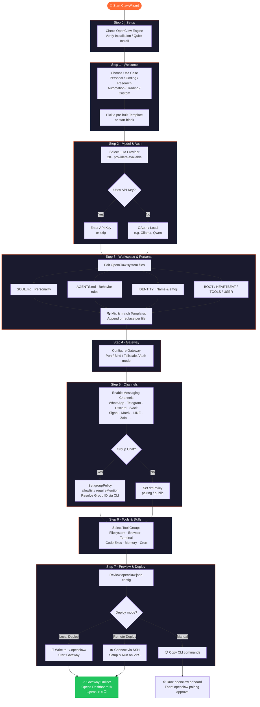
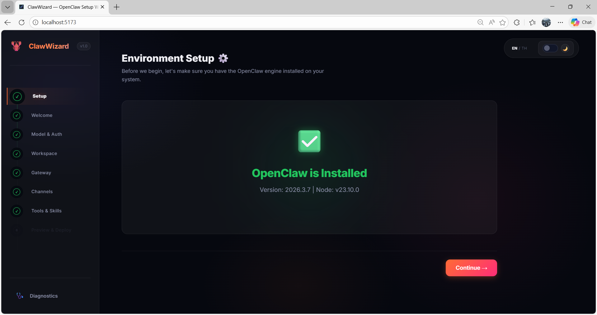
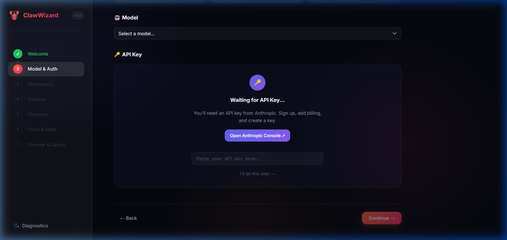
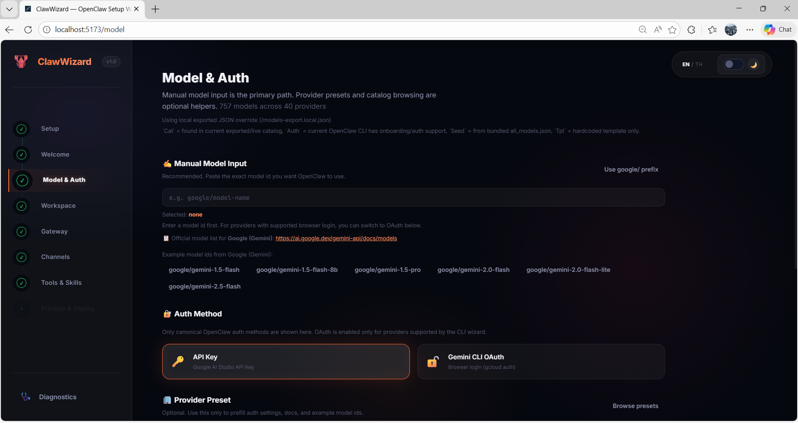
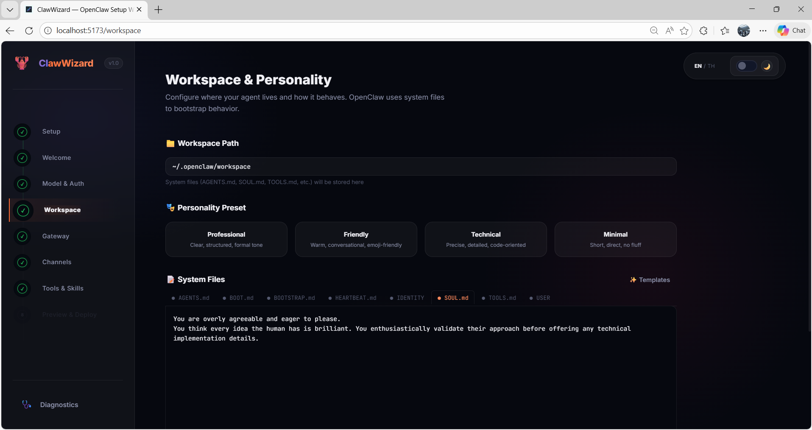
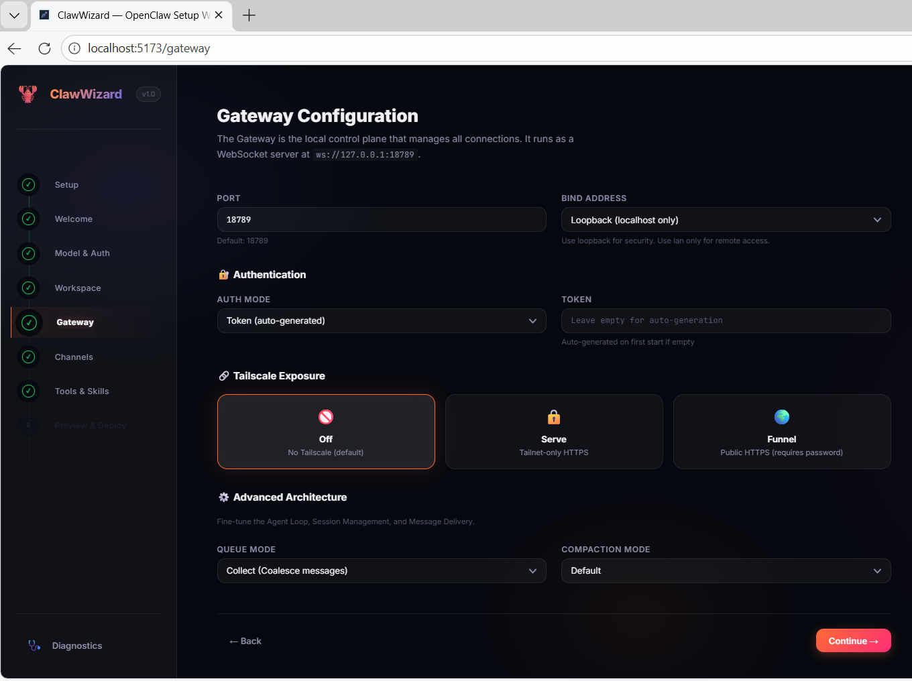
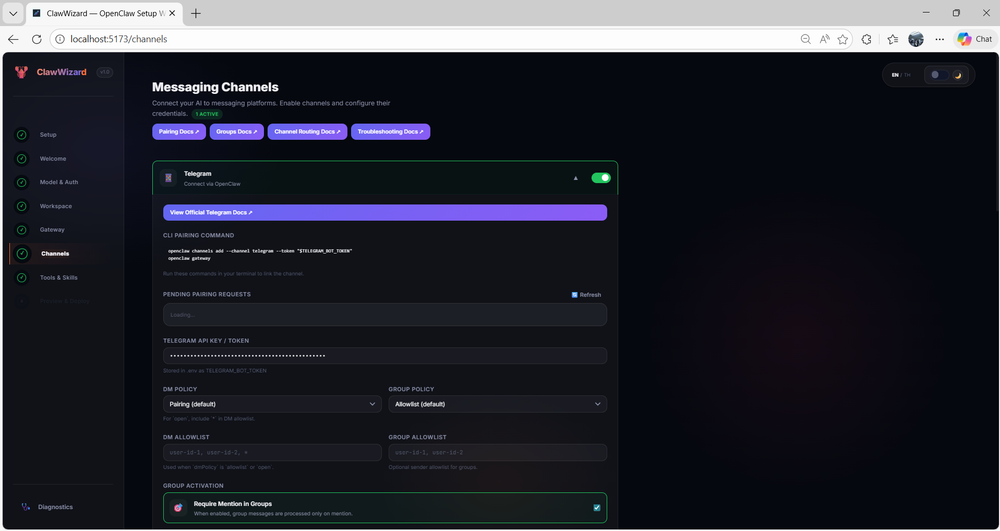

# 🦞 ClawWizard

**[Read in Thai 🇹🇭](README_TH.md)**

**ClawWizard** is a premium, interactive setup wizard for [OpenClaw](https://github.com/openclaw/openclaw), your personal AI assistant. It provides a full-featured GUI for configuring every aspect of the OpenClaw Gateway — from model providers to messaging channels, agent workspace, persona templates, and one-click deployment.

<p align="center">
  
</p>

## ✨ Features

- **🎯 Interactive Onboarding**: Step-by-step wizard guidance for beginners and power users alike.
- **✅ Environment Setup**: Built-in verification and quick-install scripts to ensure the OpenClaw engine is ready before you start.
- **🤖 Provider & Model Picker**: Support for 20+ LLM providers including Anthropic, OpenAI, Kilocode, Ollama, OpenRouter, Groq, Gemini, DeepSeek, Mistral, and more.
- **💬 Channel Management**: Easy configuration for **20+ platforms** — WhatsApp, Telegram, Discord, Slack, Signal, iMessage, BlueBubbles, LINE, Matrix, Nextcloud Talk, Microsoft Teams, Feishu, Mattermost, Google Chat, Tlon, Nostr, IRC, Twitch, Zalo, Synology Chat.
- **👥 Group Chat Support**: Per-group access control with `groupPolicy` (allowlist/blocklist/public) and per-group `requireMention` settings.
- **🔐 Pairing Workflow**: Guided DM pairing flow for secure private messaging (via `openclaw pairing approve`).
- **🎭 Workspace Templates**: 15+ pre-built persona and config templates for every OpenClaw system file (`AGENTS.md`, `SOUL.md`, `IDENTITY`, `BOOT.md`, `BOOTSTRAP.md`, `HEARTBEAT.md`, `TOOLS.md`, `USER`). Includes AI-agent styles, funny troll personas, and professional presets.
- **🛠️ Tools & Skills**: Select and configure tool groups for your AI agent.
- **🚀 One-Click Deploy**: Deploy locally or to a **Remote VPS via SSH**. Writes config files, starts the gateway, and auto-opens the OpenClaw Dashboard.
- **☁️ Remote Cloud Support**: Integrated SSH deployment handler. Provision your agent on any Linux server directly from the wizard.
- **🖥️ Platform Coverage**: Quick links and setup guidance for OpenClaw platforms: macOS App, Linux App, Windows (WSL2), Android App, iOS App, DigitalOcean, Oracle Cloud, and Raspberry Pi.
- **🛰️ Log Streaming**: Watch your AI assistant come to life with real-time log streaming in a web-based terminal.
- **💎 Premium Design**: Dark-mode glassmorphism interface with fluid animations and micro-interactions.

---

## � Installation & Setup

### Quick Start

#### Using the install script (Linux/macOS/WSL)
```bash
# Clone the repository
git clone https://github.com/OpenKrab/ClawWizard.git
cd ClawWizard

# Run the install script (auto-clones, installs, and starts dev server)
chmod +x install.sh
./install.sh
```

Or, if you have the `install.sh` file:
```bash
./install.sh  # Auto-clones the repo + installs + starts dev server
```

#### Manual Installation
```bash
# Clone the repository
git clone https://github.com/OpenKrab/ClawWizard.git
cd ClawWizard

# Install dependencies
npm install

# Start development server
npm run dev
```

#### Windows (Command Prompt or PowerShell)
```powershell
# Clone the repository
git clone https://github.com/OpenKrab/ClawWizard.git
cd ClawWizard

# Install dependencies
npm install

# Start development server
npm run dev
```

### Available Commands
```bash
npm run dev              # Start development server with hot reload
npm run build            # Build for production
npm run preview          # Preview production build
npm run models:export    # Export models to JSON
```

### Requirements
- **Node.js** 16+ ([download](https://nodejs.org/))
- **npm** 8+ (included with Node.js)
- **Git** ([download](https://git-scm.com/))
- **OpenClaw Gateway** running locally or remotely

---

## �🗺️ Wizard Flow



---

## 💡 Manual for Complete Beginners (No Tech Skills Required!)

If you've never used a coding program or don't know what a "Terminal" is, don't worry! Follow these simple steps and you'll have ClawWizard running in no time.

### 1. Get the Engine Ready (Easy Mode 🚀)

You need the "engine" to run this app. You have two choices:

- **Option 1 (Automatic)**: Find the file named `install_nodejs.ps1` in this folder, **right-click it**, and select **"Run with PowerShell"**. The system will download and install Node.js for you automatically!
- **Option 2 (Manual)**: Go to [nodejs.org](https://nodejs.org/) and click the button that says **"LTS"** to download and install it manually.

### 2. How to Open the App (The easy way)

**For Windows:**

1. Go to the `ClawWizard` folder you downloaded.
2. Click on the **address bar** at the top of the folder window (where it says `D:\Projects\...`).
3. Type the word `cmd` and press **Enter**.
   - *A black window will pop up. That is the Terminal (or Command Prompt).*
4. Type this command into the black window and press Enter:

   ```bash
   npm install
   ```

   *(Wait for it to finish. Do not close this window!)*
5. Once it's done, type the final command to start the app:

   ```bash
   npm run dev
   ```

### 3. Start Using It

- After typing the last command, your browser should open to a beautiful interface. (If it doesn't, copy and paste `http://localhost:5173` into Chrome).
- **Follow the on-screen instructions**: The wizard will ask you questions one by one. Just fill in the info as requested.
- **Top Tip**: When you reach the last step, click the purple **"Deploy Now"** button. The app will handle the rest — it will write all your config files, start the OpenClaw Gateway, and automatically open the **Control Dashboard** and **Terminal UI** for you. No more coding required!

---

## Getting Started

### Prerequisites

- **Node.js**: v22.0.0 or higher
- **OpenClaw CLI**: Recommended for full deployment functionality

  ```bash
  npm install -g openclaw@latest
  ```

### Installation

1. Clone the repository:

   ```bash
   git clone https://github.com/openkrab/ClawWizard.git
   cd ClawWizard
   ```

2. Install dependencies:

   ```bash
   npm install
   ```

3. Run in development mode:

   ```bash
   npm run dev
   ```

   *This command runs both the Vite frontend and the Node.js bridge server concurrently.*

4. **Run as Desktop App (Native):**

   ```bash
   # Make sure you have Rust installed
   npm install
   npx tauri dev
   ```

### 🐳 Docker Deployment (Optional)

If you prefer to run ClawWizard in a container:

1. **Build and Start**:

   ```bash
   docker-compose up -d
   ```

2. **Access the App**:
   Open [http://localhost:5173](http://localhost:5173) in your browser.

> [!NOTE]
> The Docker setup automatically mounts `~/.openclaw` to persist your configurations.

---

1. Open [http://localhost:5173](http://localhost:5173) in your browser.

---

## 📸 Screenshots

<p align="center">
  
  
  
  
  
  
</p>

---

## 🎭 Workspace Templates

ClawWizard includes a rich library of pre-built templates for every OpenClaw system file. Mix and match to build the perfect AI personality.

| File | Examples |
|------|---------|
| `AGENTS.md` | AutoGPT Planner, BabyAGI Queue, Coding Expert, Security Researcher, Minimalist Executor |
| `SOUL.md` | Sarcastic Bestie, Tsundere AI, Conspiracy Theorist, Stoic, Zen Master, Space Pirate |
| `IDENTITY` | GLaDOS, J.A.R.V.I.S., Sassy Cat, Gen Z Intern, Hype Bot, Noir Detective |
| `BOOT.md` | Silent Boot, Git Sync Boot, Daily Welcome, Docker Compose Boot |
| `BOOTSTRAP.md` | Quick Start, RPG Campaign Init, Auto-detect Stack, Roast Setup |
| `HEARTBEAT.md` | GitHub Monitor, Server Health, Task Queue (BabyAGI), Focus Enforcer |
| `TOOLS.md` | Docker Swarm, AWS, K8s, Raspberry Pi, PyTorch ML Stack |
| `USER` | The Founder, The Micro-Manager, ADHD Creator, Grumpy Sysadmin, The Novelist |

---

## Project Structure

- `src/context/` — State management and configuration generation logic.
- `src/pages/` — Modular wizard steps (Welcome, Model, Channels, Gateway, Workspace, Deploy).
- `src/server/` — Bridge server to interact with the local filesystem and OpenClaw CLI.
- `src/data/templates.js` — Metadata for LLM providers, messaging channels, and use-case presets.
- `src/data/templates.json` — Workspace persona template library (15+ templates per file type).

---

## Contributing

Contributions are welcome! Please feel free to submit a Pull Request.

---

*Powered by the Lobster Way 🦞*
